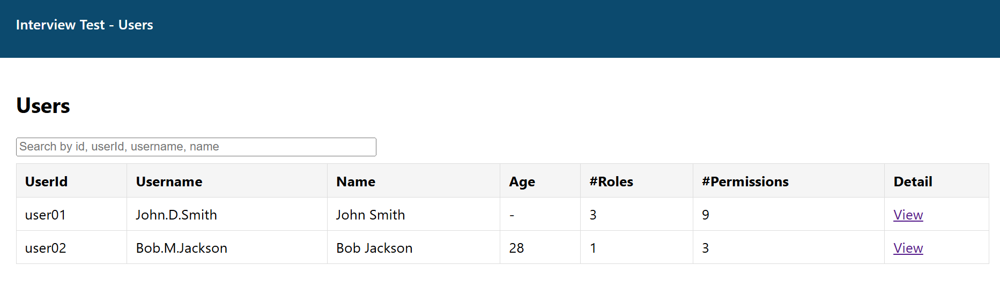
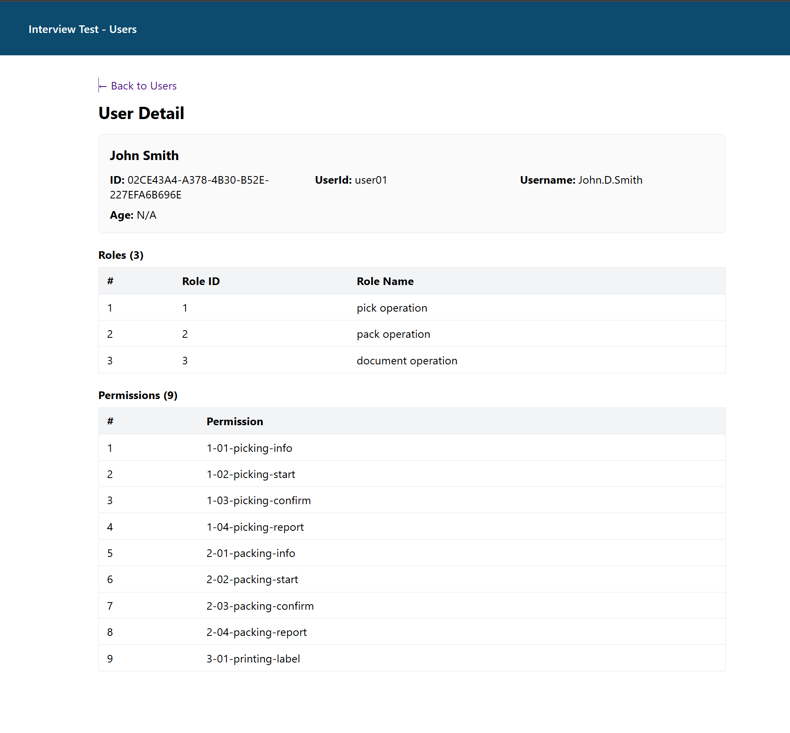

# Interview-Test.Client (Angular 19, Standalone)

This is a minimal Angular frontend that displays a Users List and a User Detail page from API.

- Implement screen Users List

- Implement screen Users Detail

- Connect data from API Gateway Ocelot.

## Features

- Users List (`/users`) with columns: UserId, Username, Name, Age, number of Roles, number of Permissions
- Search textbox to filter data: id, userId, username, full name
- User Detail (`/users/:id`) display data: User info, Roles, and Permissions

## Run locally

1. Open a terminal at `Interview-Test/Interview-Test/Interview-Test.Client`
2. Install dependencies:
    - `npm install`
3. Start the dev server:
    - `npm start`
4. Open a browser at:
    - `http://localhost:4200/users`
